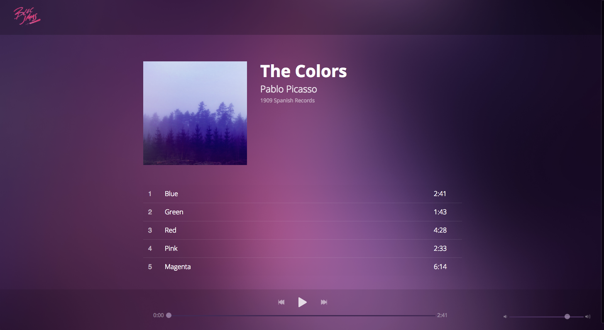

# Bloc Jams jQuery

Bloc Jams jQuery is a project made from a starter kit provided by Bloc. This is a music-streaming-app built with jQuery. The logic was written by me with the help of my mentor. The CSS styling was done with boilerplate code provided by Bloc.

